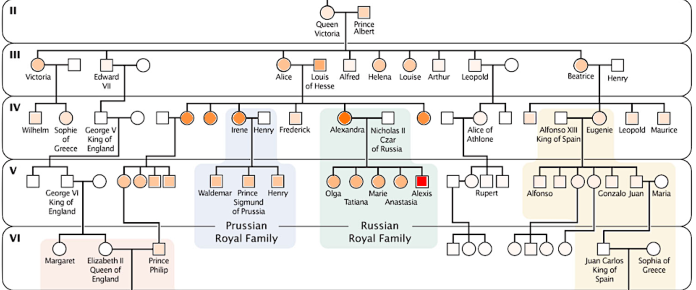

## Bloodlines (Part One)

The assignment description can be found [here](https://docs.google.com/document/d/1WCT4cLG8DxNZdXHiM2NAvv2GcEypscKOwGRSE4eJ_T8/edit?usp=sharing).

This repository contains starter code:
- `factor.py`: Code for questions one, two, and three goes in this file
- `bayes.py`: Code for question four goes in this file
- `genetics.py`: Code for questions five, six, seven, eight, and nine goes in this file

It also contains code that you can use and/or emulate but should not change:
- `covid.py`: The Covid-19 Bayesian network discussed in class.
- `montyhall.py`: The Monty Hall Bayesian network discussed in class.
- `vampire.py`: The blood types Bayesian network discussed in class.
- `util.py`: Contains the utility function `compute_elimination_order`.

Finally it contains the visualizer:
- `bloodlines.py`: Run this from the command-line once you've completed questions one through nine.

Ignore (but do not delete!!!) the other files in this repository.